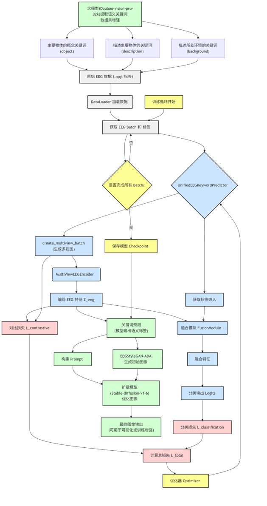
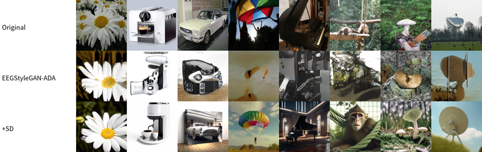

# Brain Visual Reconstruction Guided by Agent-Mediated Semantic Concepts

This project aims to reconstruct semantically meaningful images from EEG signals.

## Overview

The core idea involves a two-stage process:

1. **Initial Generation**: Use a generative adversarial network (EEGStyleGAN-ADA) to produce a rough image from EEG features.
2. **Guided Refinement**: Extract semantic keywords from EEG representations and use them, along with the initial image, as input to a diffusion model (Stable Diffusion v1-6) for refinement and enhancement. The result is a high-quality image that better aligns with human brain representations.

## Dataset

We use the **EEGCVPR40** dataset, which contains EEG recordings from six subjects viewing 2,000 images across 40 categories, resulting in 11,976 samples. Each EEG sample is about 0.5 seconds long (approximately 500 time steps at 1024 Hz sampling rate).

## Agent-Based Workflow

The system integrates multiple AI agents that collaboratively perform the following tasks:

### Agent Tasks

* **Semantic Augmentation**: A multimodal LLM (Doubao-vision-pro-32k) extracts keywords from original images to generate pseudo-labels for training augmentation.

* **Keyword Standardization**: An inference LLM (DeepSeek-R1) performs semantic normalization by clustering synonyms and similar terms.

* **Prompt Generation for Image Enhancement**: Using the predicted keywords and GAN-generated image, an LLM creates positive and negative prompts for image optimization with Stable Diffusion v1-6.

* **Workflow Orchestration**: Manages training scheduling, multi-model coordination, and inference API calls.

## Architecture Diagram

## Demo Deployment

Due to platform constraints, a Gradio app was deployed on the ModelScope platform for predicting EEG (in `.npy` format) labels, accessible here:

🔗 [Gradio App - Huggingface](https://huggingface.co/spaces/pyinglie/diting-basic)

🔗 [Gradio App - Modelscope](https://pyinglie-diting-basic.ms.show/)

## Classification Performance

The table below compares performance across different models for EEG-based image classification on the test set:

| Approach                      | Accuracy (%) |
| ----------------------------- | ------------ |
| Stacked Bi-LSTM               | 22           |
| EEGCVPR40                     | 26           |
| SyncNet                       | 27           |
| EEGNet                        | 32           |
| EEG-ChannelNet                | 36           |
| GRU Gated Transformer         | 46           |
| SigTanh Gated Transformer     | 49           |
| EfficientNet + SVM            | 64           |
| Proposed Bi-LSTM Approach     | 71           |
| Proposed Transformer Approach | 59           |
| **Ours**                      | **62**       |

## Current Capabilities

We have completed the development of **Diting-Basic**, which takes an EEG sample (as a `.npy` URL) as input and returns the URL of the reconstructed image. Currently, GAN image generation relies on pre-generated URLs due to time and compute constraints.

Because no Image-to-Image services were found on domestic cloud platforms, the final image is generated using text prompts on Volcano Cloud's text-to-image API.

## Planned Development: Diting-Development

The goal is to develop an end-to-end training-evaluation-inference agent workflow. The user submits an EEG-image dataset URL and receives:

* Checkpoints
* Evaluation metrics
* Sample predictions
* Reconstructed image URLs

Due to compute limitations, current plugin functionality is placeholder-based and returns precomputed outputs.

## Preliminary Results on Sample Optimization

Due to incomplete training of the multi-label classification model (for predicting "Description" and "Background" keywords), we tested prompt-based optimization using LLM-generated keywords on 330 samples from Subject 1.

The optimized images show promising improvements, especially in FID:

| Metric   | EEGStyleGAN-ADA | + Stable Diffusion |
| -------- | --------------- | ------------------ |
| GA (↑)   | 2.2136          | 2.4494             |
| IS (↑)   | 5.01 ± 0.43     | 6.89 ± 1.06        |
| FID (↓)  | 233.16          | 110.93             |
| SSIM (↑) | 0.1897          | 0.1980             |
| PSNR (↓) | 8.55 dB         | 8.50 dB            |

## References

* Singh, P., et al. (2023). *Learning robust deep visual representations from EEG brain recordings*. \[Preprint].
* Palazzo, S., et al. (2020). *Decoding brain representations by multimodal learning of neural activity and visual features*. IEEE TPAMI, 42(12), 3337–3351. [https://doi.org/10.1109/TPAMI.2020.2995909](https://doi.org/10.1109/TPAMI.2020.2995909)
* Spampinato, C., et al. (2017). *Deep learning human mind for automated visual classification*. CVPR, 4503–4511.
* Sharma, A., et al. (2025). *EEG classification for visual brain decoding with spatio-temporal and transformer-based paradigms*. ICVGIP '24. [https://doi.org/10.1145/3702250.3702286](https://doi.org/10.1145/3702250.3702286)